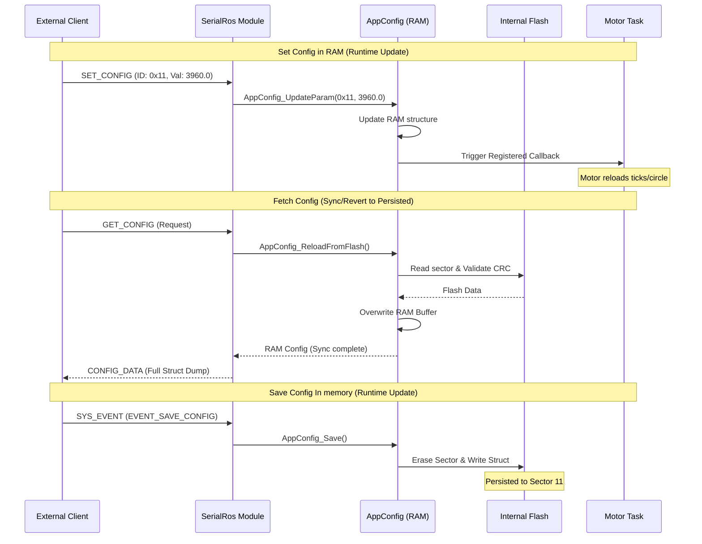
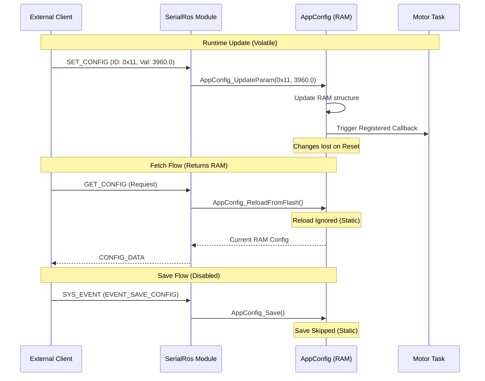

# Configuration Manager (AppConfig) Component

The **ConfigManager** (implemented as `AppConfig`) is a centralized system for managing robot parameters. It provides a bridge between compile-time defaults (Static) and runtime-adjustable parameters stored in Non-Volatile Memory (Flash).

## System Overview

The system allows the robot to adapt to different hardware configurations or environmental requirements without re-flashing the firmware. It handles:
- **Parameter Storage**: Managing values like PID status, motor ticks, and publishing periods.
- **Persistence**: Saving and loading configurations to/from the internal Flash memory.
- **Dynamic Updates**: Modifying parameters at runtime via serial commands.
- **Synchronization**: Notifying other modules (Motor Control, Telemetry, etc.) when a parameter changes.

---

## Operating Modes

The system operates in two modes, controlled by the `PESISTENT_CONFIG` macro in [config.h](Application/Config/Inc/config.h):

### 1. Static Mode (`PESISTENT_CONFIG` disabled)
- Parameters are pulled directly from `DEFAULT_` macros in `config.h`.
- Changes made via Serial are lost on reboot.
- Useful for stable production builds where parameters are fixed.

### 2. Memory Mode (`PESISTENT_CONFIG` enabled)
- At boot, the system attempts to load a config structure from Flash.
- If Flash is empty or corrupted (CRC failure), it initializes with defaults from `config.h`.
- Parameters are stored in the `g_current_config` RAM structure.
- Updates can be persisted to Flash using the `AppConfig_Save()` function.

---

## Data Structures

### AppConfig_t
The core structure containing all configurable variables. It includes a `magic` number for validation and a `crc` for integrity.

```c
typedef struct {
    uint32_t magic;                 /* 0xABCD1234 */
    
    /* Debug & System */
    uint32_t debug_level;
    uint32_t telemetry_period_ms;
    uint32_t sys_vars_period_ms;
    uint32_t imu_publish_period_ms;
    uint32_t odom_publish_period_ms;
    
    /* Motor Parameters */
    uint32_t pid_enabled_default;
    float    motor_ticks_per_circle;
    float    motor_rps_limit;
    ...
    
    uint32_t crc;                   /* Integrity Check */
} AppConfig_t;

/**
 * @brief Global pointer to the current live configuration.
 * Read-only access for modules.
 * Usage: uint32_t val = AppConfig->telemetry_period_ms;
 */
extern const AppConfig_t * const AppConfig;

### AppConfigParamId_t
A unique ID is assigned to every parameter to facilitate updates via the `SerialRos` protocol.

| ID | Parameter Name | Type | Description |
| :--- | :--- | :--- | :--- |
| **0x01** | `CONF_DEBUG_LEVEL` | uint32 | Log level (INFO, WARN, DEBUG) |
| **0x02** | `CONF_TELEMETRY_PERIOD` | uint32 | Global telemetry period (ms) |
| **0x10** | `CONF_PID_ENABLED` | bool | Default PID state at boot |
| **0x11** | `CONF_MOTOR_TICKS` | float | Encoder ticks per revolution |
| **0x31-34** | `CONF_MOTORx_INV` | int32 | Motor direction inversion (0/1) |

---

## Synchronization Mechanism (Callbacks)

When a parameter is updated (e.g., via a remote dashboard), other system modules must be informed to apply the change immediately.

1. **Registration**: Modules (like `task_telemetry` or `task_mobility`) register a callback function during their initialization using `AppConfig_RegisterCallback()`.
2. **Notification**: When `AppConfig_UpdateParam()` is called, it triggers `AppConfig_NotifyChange()`.
3. **Execution**: All registered callbacks are executed, allowing modules to reload values from the global config struct.

> [!NOTE]
> This pattern ensures that changing the telemetry period at runtime actually restarts the system timers with the new period without requiring a reboot.

---

## SerialRos Integration

The `ConfigManager` is tightly integrated with the [SerialRos Module](docs/serial_ros.md):

- **Topic 0x08 (`SET_CONFIG`)**: Sends a pair of `(ID, Value)`. The `AppConfig_UpdateParam` processes this to update RAM.
- **Topic 0x09 (`REQUEST_CONFIG`)**: Triggers a response from the MCU.
- **Topic 0x84 (`GET_CONFIG`)**: The MCU publishes the entire `AppConfig_t` structure to the ROS host.

### Command Flow



### Command Flow (Static Mode — PESISTENT_CONFIG disabled)

When operating in Static Mode, changes are volatile and persistence is disabled.



---

## Persistence Details

- **Flash Sector**: Sector 11 is reserved for configuration.
- **Base Address**: `0x080E0000`.
- **Integrity**: Every save recalculates a simple additive checksum. On boot, if the checksum doesn't match the stored `crc` field, the system wipes the sector and reverts to hardcoded defaults to prevent undefined behavior.

---

## Module API

| Function | Purpose |
| :--- | :--- |
| `AppConfig` | **Primary Access**: Global read-only pointer to the structure. |
| `AppConfig_Init()` | Initializes module, loads from Flash if enabled. |
| `AppConfig_UpdateParam(id, val)` | Updates a specific parameter in RAM only (Runtime) and notifies listeners. |
| `AppConfig_ReloadFromFlash()` | Reloads configuration from Flash to RAM (Reverts unsaved changes). |
| `AppConfig_Save()` | Commits the current RAM structure to internal Flash. |
| `AppConfig_ResetToDefaults()` | Wipes Flash/RAM and reloads values from `config.h`. |
| `AppConfig_RegisterCallback(cb)` | Adds a listener for configuration change events. |

---

## Implementation Reference

| Layer | File |
| :--- | :--- |
| **Main API** | [app_config.h](Application/Config/Inc/app_config.h) |
| **Core Logic** | [app_config.c](Application/Config/Src/app_config.c) |
| **Static Defaults** | [config.h](Application/Config/Inc/config.h) |
| **Low-level Flash** | [bsp_internal_flash.c](Drivers/BSP/FlashStorage/Src/bsp_internal_flash.c) |
