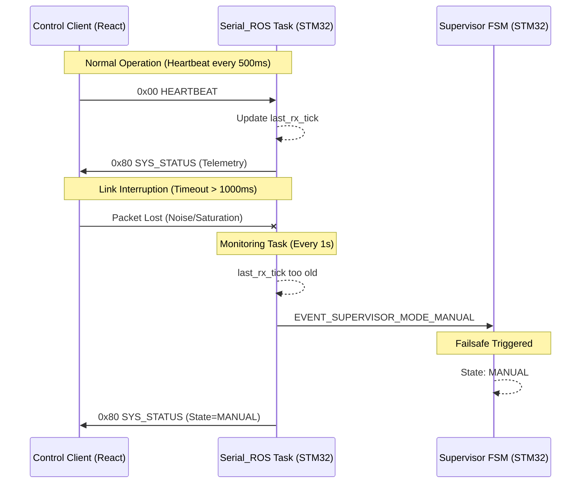

# Heartbeat and Connection Monitoring Mechanism

The system implements a bidirectional health check mechanism between the control client (React Dashboard) and the embedded controller (STM32). This process ensures the operational integrity of the robot, particularly during autonomous execution or remote control modes.

## Client-Side Architecture (Frontend)

The client maintains an active connection by periodically sending heartbeat packets via the SerialRos binary protocol.

- **Transmission Frequency**: A heartbeat packet is emitted every **500 ms**.
- **Action on Disconnection**: If the client detects a loss of serial communication or network bridge connectivity, it stops emitting control commands and displays a disconnected status in the user interface.
- **State Synchronization**: Upon re-establishing a connection, the client automatically requests a full configuration dump (`GET_CONFIG`) to synchronize its internal state with the MCU's Flash memory.

## MCU-Side Architecture (Firmware)

The firmware manages connection health through a dedicated module within the `SerialRosTask`.

### 1. Reception Detection
Each time the `SerialRos` module processes a valid packet from the client (whether an explicit heartbeat or any control command), an internal timestamp named `last_rx_tick` is updated using the operating system's tick counter (FreeRTOS).

### 2. Timeout Monitoring
The `SerialRosTask` performs a connectivity evaluation every **1000 ms**. The connection state is determined by the following logic:
- **Validity Criterion**: The connection is considered active if the difference between the current tick and `last_rx_tick` is less than the value defined in `SERIAL_ROS_COMMS_TIMEOUT_MS` (currently **1000 ms**).
- **Tolerance Margin**: Since the client sends heartbeats every 500 ms, the system allows for the loss of up to one packet before declaring a disconnection.

### 3. Safety Mechanism (Failsafe)
If a connectivity loss is detected (`is_connected == false`), the firmware executes the following safety actions:
- **State Transition**: If the system is in `AUTO` mode (Autonomous Control), the Supervisor FSM forces an immediate transition to the `MANUAL` state.
- **Motor Neutralization**: Upon entering the `MANUAL` state without an active operator, the mobility system stops any residual movement to prevent collisions or erratic behavior.

## Interaction Sequence

## Communication Protocol

The exchange is based on the `Serial_Ros_Protocol`, utilizing the following identifiers:

| Topic ID | Name | Direction | Payload | Description |
| :--- | :--- | :--- | :--- | :--- |
| `0x00` | `HEARTBEAT` | Client → MCU | (Empty) | Presence notification. |
| `0x81` | `SYS_STATUS` | MCU → Client | `SystemStatusMsg_t` (20B) | Telemetry of state, errors, and battery. |
| `0x09` | `GET_CONFIG` | Client → MCU | (Empty) | Request full configuration dump. |
| `0x84` | `APP_CONFIG` | MCU → Client | `AppConfig_t` (~140B) | Full dump of system parameters. |

This design ensures that communication link failures, excessive latencies, or unexpected crashes of the control software result in a safe and predictable state for the robot hardware.
