# Motor Control Operation

This document describes the implementation and operation of the motor control system for the SME-STM32F407-4WCL robot.

## 1. System Overview

The motor control system is responsible for managing four DC motors with encoders in a closed-loop configuration (PID) or open-loop for testing. It handles everything from raw pulse counting to high-level kinematics for various chassis types (Mecanum, Differential, etc.).

### Key Components

| Component | File | Responsiblity |
| :--- | :--- | :--- |
| **Feedback Task** | `task_sensors.c` | High-frequency acquisition of encoder counts and velocity estimation. |
| **Control Task** | `task_mobility.c` | FSM-based logic for processing movement commands. |
| **Motor Module** | `encoder_motor.c` | Logic for individual motor objects, including PID application. |
| **PID controller** | `pid.c` | Incremental PID algorithm implementation. |
| **Kinematics** | `kinematics_*.c` | Mathematical models for wheel velocity distribution. |

---

## 2. Feedback Loop (Sensor Acquisition)

The feedback loop resides in `task_sensors.c`, running at **100Hz** (default).

### Velocity Estimation
For each motor, the raw encoder count is fetched from the hardware timers. The velocity is estimated using the following process:
1. **Delta Calculation**: Change in pulses since the last update.
2. **Filtering**: A simple low-pass filter is applied to the Ticks-Per-Second (TPS):
   $$TPS_{filt} = TPS_{new} \cdot 0.9 + TPS_{old} \cdot 0.1$$
3. **Normalization**: Conversion from TPS to Rotations-Per-Second (RPS) using the configured `motor_ticks_per_circle`.

The measured RPS is then stored in the `RobotState` for telemetry and control.

---

## 3. Kinematic Models

The system supports multiple drive configurations. The goal is to calculate the individual wheel velocities ($v_i$ in m/s) based on the target system velocities: $v_x$ (linear forward), $v_y$ (linear lateral), and $a_z$ (angular rotation).

### 3.1 Mecanum (Holonomic)
Used for 4-wheel Mecanum chassis allowing movement in any direction.
- $L$: `wheelbase_length` / 2
- $W$: `shaft_width` / 2

$$v_{w1} = v_x - v_y - (L+W) \cdot a_z$$
$$v_{w2} = v_x + v_y - (L+W) \cdot a_z$$
$$v_{w3} = v_x + v_y + (L+W) \cdot a_z$$
$$v_{w4} = v_x - v_y + (L+W) \cdot a_z$$

### 3.2 Differential (4WD Skid-Steer)
Standard drive where the left and right sides move independently.
- $d$: `shaft_width` (distance from center to wheel)

$$v_{left} = v_x - d \cdot a_z$$
$$v_{right} = v_x + d \cdot a_z$$

*Mapping: $v_{w1}, v_{w2}$ receive $v_{left}$ | $v_{w3}, v_{w4}$ receive $v_{right}$*

### 3.3 Ackermann (Virtual)
Simplified model for 4-wheel chassis mimicking a car-like steering response using differential speeds.
- $d$: `shaft_width`

$$v_{left} = v_x - d \cdot a_z$$
$$v_{right} = v_x + d \cdot a_z$$

### 3.4 Direct (Debug)
Used for direct control testing. Passes rotation as a simple differential offset.

$$v_{left} = v_x - a_z$$
$$v_{right} = v_x + a_z$$

### Linear to Angular Conversion
Once the wheel linear velocity $v_i$ is calculated, it is converted to target RPS using the wheel diameter:
$$RPS_{target} = \frac{v_i}{\pi \cdot D_{wheel}}$$

> [!IMPORTANT]
> **Motor Inversion**: Physically, motors on the right side (Motors 2 and 3) are flipped 180°. The firmware automatically applies the `motor_invert` sign configured in `AppConfig` immediately before sending the pulse to the hardware timers.

## 4. Control Loop (PID Logic)

The core control logic is executed in `encoder_motor_control` at **50Hz**.

### Incremental PID Algorithm
The system uses an **Incremental PID** controller to calculate the change in PWM output ($\Delta u$):
$$\Delta u = K_p (e_k - e_{k-1}) + K_i (e_k \cdot T) + K_d \frac{e_k - 2e_{k-1} + e_{k-2}}{T}$$

Where:
- $e_k$: Current error (Target RPS - Measured RPS).
- $T$: Loop period (0.02s).

**Closed-Loop Mode**: $\text{PWM}_{new} = \text{PWM}_{old} + \Delta u$
**Open-Loop Mode**: Simple linear mapping of Target RPS to Max PWM.

### Safety and Stability
- **Clamping**: PWM output is strictly limited to $\pm \text{AppConfig->motor\_pwm\_max}$.
- **Deadband**: If the target speed is 0 and the calculated pulse is within the motor-specific `deadzone` (defined in `AppConfig->motor[1-4]_deadzone`), the output is forced to 0 to prevent motor whining.

---

## 5. RTOS Integration

The system leverages several tasks to ensure deterministic behavior:

| Task | Frequency | Priority | Role |
| :--- | :--- | :--- | :--- |
| **SensorsTask** | 100Hz | High | Encoder reading & Velocity estimation. |
| **MobilityTask** | 50Hz | High | FSM execution & PID control. |
| **TelemetryTask** | Varied | Medium | Reporting motor status and errors. |

---

## 6. Configuration Parameters

The system behavior is governed by the `AppConfig_t` structure. These parameters can be modified at runtime via the SerialRos protocol (Topic 0x08).

| Parameter Group | IDs | Type | Unit | Description |
| :--- | :--- | :--- | :--- | :--- |
| **Global Motor** | `0x11-14` | `float/u32` | Ticks, RPS | Ticks/rev, RPS limit, and PWM Max. |
| **Kinematics** | `0x20-22` | `float` | meters | Wheel diameter, shaft width, wheelbase. |
| **Inversion** | `0x31-34` | `int32` | 1 / -1 | Direction multiplier for each motor. |
| **PID Gains** | `0x4x` | `float` | - | Kp, Ki, Kd coefficients for motors 1-4. |
| **Deadzone** | `0x4x` | `float` | PWM pulses | Individual pulse deadband per motor. |

---

## 7. Operational States

The Mobility FSM (`mobility_fsm.c`) ensures the motors are in a safe state:
- **INIT**: Calibrating and resetting hardware.
- **IDLE**: Targets are zeroed, but PID might still be active to maintain position.
- **MOVING**: Active tracking of velocity targets.
- **FAULT/ABORT**: Immediate hard-brake and PWM shutdown.
---

## 8. Control Flow

The following diagram illustrates the interaction between the different system tasks and modules during a standard movement cycle.

```mermaid
sequenceDiagram
    participant ST as SensorsTask (100Hz)
    participant MT as MobilityTask (50Hz)
    participant K as Kinematics
    participant EM as EncoderMotor Module
    participant HW as Motor Hardware (Timers)

    Note over ST, HW: Feedback & Control Synchronization

    rect rgb(10, 20, 40)
    Note right of ST: Feedback Loop
    HW->>ST: Raw Encoder Ticks (DMA/IT)
    ST->>ST: Calculate Delta and Filter TPS
    ST->>EM: Update measured_rps
    end

    rect rgb(20, 40, 60)
    Note right of MT: Control Loop
    MT->>K: Calculate target wheel velocities (m/s)
    K-->>MT: Return wheel speeds
    MT->>EM: encoder_motor_control(target_rps)
    
    activate EM
    EM->>EM: Fetch individual MotorX PID/Deadzone from AppConfig
    EM->>EM: pid_compute(target, measured)
    EM->>EM: Apply Deadzone Compensation
    EM->>HW: Set Comparison Register (PWM Output)
    deactivate EM
    end
```

