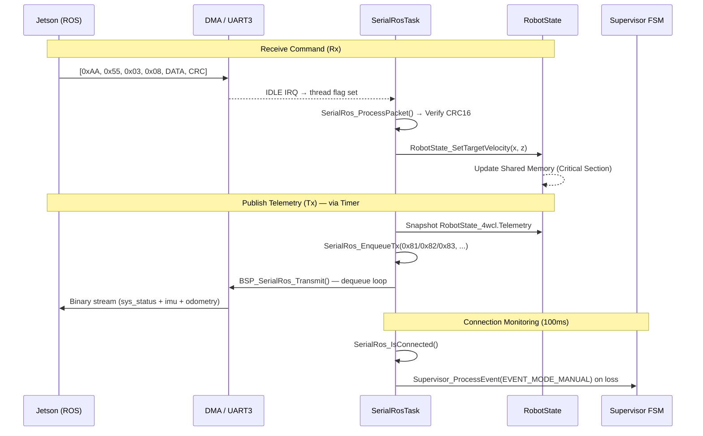

# SerialRos Module Specification

This document details the binary communication protocol implemented for the high-speed link between the MCU (Real-time Controller) and the PC (ROS Master).

## Protocol Overview

The protocol uses a **Binary Framing** format to ensure the smallest possible HEX size and the highest processing speed. It operates on **USART3** at **115200 bps** (configurable) using DMA and IDLE line detection.

### Frame Format

| Field     | Size (Bytes) | Description                          |
| :-------- | :----------- | :----------------------------------- |
| **SYNC1** | 1            | Always `0xAA`                        |
| **SYNC2** | 1            | Always `0x55`                        |
| **MSG_ID**| 1            | Virtual Topic Identifier             |
| **LENGTH**| 1            | Payload size in bytes                |
| **DATA**  | N            | Raw binary data (Packed struct)      |
| **CRC16** | 2            | Little-endian CRC16-Modbus (0xA001) |

---

## Virtual Topics (Message IDs)

### Rx Topics — PC → MCU (Subscribed)

| ID       | Name              | Payload Structure                          | Description                              |
| :------- | :---------------- | :----------------------------------------- | :--------------------------------------- |
| **0x01** | `autonomous`      | `uint8 is_autonomous`                      | Switch between Manual/Auto mode.         |
| **0x02** | `mobility_mode`   | `uint8 mobility_mode, uint8 is_autonomous` | Mobility type + autonomous flag (`SysConfigMsg_t`). |
| **0x03** | `cmd_vel`         | `float linear_x, float angular_z`         | Movement setpoints.                      |
| **0x04** | `arm_goal`        | `float j1, float j2, float j3`            | Robotic arm joint targets.               |
| **0x05** | `sys_event`       | `uint8 event_id`                           | Logic events (START, RESET, STOP, etc.). |

### Tx Topics — MCU → PC (Published)

| ID       | Name          | Payload Structure                                                          | Description                               |
| :------- | :------------ | :------------------------------------------------------------------------- | :---------------------------------------- |
| **0x81** | `sys_status`  | `uint8 state, uint64 errors, float temp, float v_batt, float i_batt`      | System state, health flags, and battery.  |
| **0x82** | `imu`         | `float roll, pitch, yaw, gyro_x/y/z, accel_x/y/z`                        | Full IMU telemetry (9 floats).            |
| **0x83** | `odometry`    | `float linear_x, float angular_z, int32 enc_1/2/3/4`                      | Velocity estimates and encoder counts.    |

---

## Message Structures (Packed)

All structures are declared with `#pragma pack(push, 1)` to avoid padding.

```c
/* Rx */
typedef struct { float linear_x; float angular_z; } CmdVelMsg_t;            // 0x03
typedef struct { float j1; float j2; float j3; } ArmGoalMsg_t;              // 0x04
typedef struct { uint8_t event_id; } SysEventMsg_t;                          // 0x05
typedef struct { uint8_t mobility_mode; uint8_t is_autonomous; } SysConfigMsg_t; // 0x02

/* Tx */
typedef struct {
    uint8_t  current_state;
    uint64_t error_flags;
    float    mcu_temp;
    float    battery_voltage;
    float    battery_current;
} SystemStatusMsg_t;                                                          // 0x81

typedef struct {
    float roll, pitch, yaw;
    float gyro_x, gyro_y, gyro_z;
    float accel_x, accel_y, accel_z;
} ImuMsg_t;                                                                   // 0x82

typedef struct {
    float   linear_x;
    float   angular_z;
    int32_t enc_1, enc_2, enc_3, enc_4;
} OdometryMsg_t;                                                              // 0x83
```

---

## Architecture: TX/RX Queue Model

The SerialRos module uses two thread-safe FreeRTOS queues to decouple producers/consumers from the hardware layer.

```
┌────────────────────────────────────────────────────────┐
│              SystemVariablesTimerCallback               │
│  (timer_system_sensors.c — runs at configurable rate)  │
│                                                        │
│  SerialRos_EnqueueTx(0x81, &status_msg, ...)           │
│  SerialRos_EnqueueTx(0x82, &imu_msg,    ...)           │
│  SerialRos_EnqueueTx(0x83, &odom_msg,   ...)           │
└──────────────────────┬─────────────────────────────────┘
                       │  rosTxQueueHandle
                       ▼
┌────────────────────────────────────────────────────────┐
│                  StartSerialRosTask                     │
│               (task_serial_ros.c — RTOS task)          │
│                                                        │
│  [RX] IRQ → osal_thread_flags_set → ProcessPacket()   │
│             → RobotState setters (thread-safe)         │
│                                                        │
│  [TX] Poll rosTxQueue → BSP_SerialRos_Transmit()      │
│       Periodic 20ms  → BuildTelemetryPacket() (0x81)  │
│       Connection check 100ms → Supervisor event        │
└────────────────────────────────────────────────────────┘
```

### Connection Detection

`SerialRos_IsConnected()` returns `true` if a valid packet (CRC OK) was received within the last `SERIAL_ROS_COMMS_TIMEOUT_MS` (1000 ms). On disconnection, the task automatically triggers `EVENT_MODE_MANUAL` on the Supervisor FSM as a safety measure.

---

## Data Flow Diagram



---

## Module API

| Function | Description |
| :--- | :--- |
| `SerialRos_Init()` | Initializes the module (resets connection timer). |
| `SerialRos_IsConnected()` | Returns `true` if ROS host is active within timeout. |
| `SerialRos_ProcessPacket(buf, size)` | Parses frame, validates CRC, dispatches to `RobotState`. |
| `SerialRos_BuildTelemetryPacket(buf, max)` | Builds a `0x81` sys_status frame directly into a buffer. |
| `SerialRos_EnqueueTx(topic_id, msg, len)` | Thread-safe Tx enqueue (from any task/timer). |
| `SerialRos_DequeueRx(packet, timeout_ms)` | Retrieve a processed Rx packet from the queue. |

---

## Implementation Reference

| Layer | File |
| :--- | :--- |
| **Protocol Defs** | [serial_ros_protocol.h](file:///c:/GIT/sme/sme-stm32f407-4wcl/Application/Modules/SerialRos/Inc/serial_ros_protocol.h) |
| **Module API** | [serial_ros.h](file:///c:/GIT/sme/sme-stm32f407-4wcl/Application/Modules/SerialRos/Inc/serial_ros.h) |
| **Module Logic** | [serial_ros.c](file:///c:/GIT/sme/sme-stm32f407-4wcl/Application/Modules/SerialRos/Src/serial_ros.c) |
| **RTOS Task** | [task_serial_ros.c](file:///c:/GIT/sme/sme-stm32f407-4wcl/Application/RTOSLogic/Src/task_serial_ros.c) |
| **Sensor Timer** | [timer_system_sensors.c](file:///c:/GIT/sme/sme-stm32f407-4wcl/Application/RTOSLogic/Src/timer_system_sensors.c) |
| **BSP Layer** | [bsp_serial_ros.c](file:///c:/GIT/sme/sme-stm32f407-4wcl/Drivers/BSP/SerialRos/Src/bsp_serial_ros.c) |
