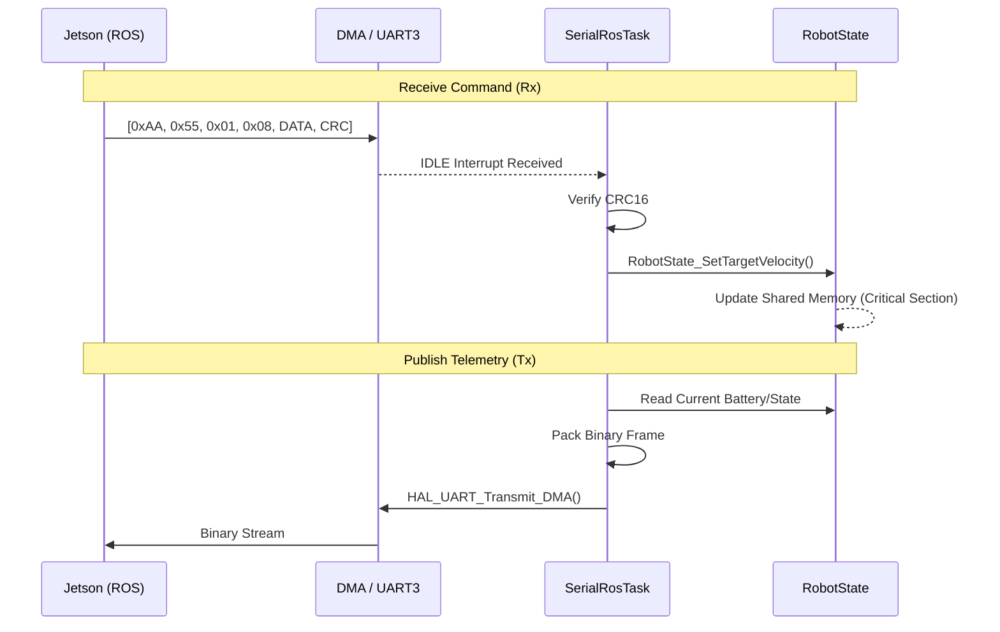

# SerialRos Module Specification

This document details the binary communication protocol implemented for the high-speed link between the MCU (Real-time Controller) and the PC (ROS Master).

## Protocol Overview

The protocol uses a **Binary Framing** format to ensure the smallest possible HEX size and the highest processing speed. It operates on **USART3** at **115200 bps** (configurable) using DMA and IDLE line detection.

### Frame Format
| Field | Size (Bytes) | Description |
| :--- | :--- | :--- |
| **SYNC1** | 1 | Always `0xAA` |
| **SYNC2** | 1 | Always `0x55` |
| **MSG_ID** | 1 | Virtual Topic Identifier |
| **LENGTH** | 1 | Payload size in bytes |
| **DATA** | N | Raw binary data (Packed) |
| **CRC16** | 2 | Little-endian CRC16-CCITT |

---

## Virtual Topics (Message IDs)

| ID | Name | Direction | Payload Structure | Description |
| :--- | :--- | :--- | :--- | :--- |
| **0x01** | `/cmd_vel` | PC → MCU | `float x, float z` | Movement setpoints. |
| **0x02** | `/arm_goal` | PC → MCU | `float j1, j2, j3` | Robotic arm joint targets. |
| **0x05** | `/sys_event` | PC → MCU | `uint8 id` | Logic events (START, STOP, etc). |
| **0x06** | `/config` | PC → MCU | `uint8 mode, uint8 auto` | Mobility mode (0-3) and Auto toggle. |
| **0x81** | `/status` | MCU → PC | `uint8 st, uint64 err, float t, float v, float i` | Consolidated status, errors, and battery. |

---

## Data Flow Diagram

The following diagram illustrates how a command from ROS reaches the robot's state and how telemetry is published back.

## Implementation Reference

- **BSP Layer:** [bsp_serial_ros.c](file:///c:/GIT/sme/sme-stm32f407-4wcl/Drivers/BSP/SerialRos/Src/bsp_serial_ros.c)
- **Task Logic:** [task_serial_ros.c](file:///c:/GIT/sme/sme-stm32f407-4wcl/Application/RTOSLogic/Src/task_serial_ros.c)
- **Protocol Defs:** [serial_ros_protocol.h](file:///c:/GIT/sme/sme-stm32f407-4wcl/Application/MainLogic/Communication/SerialRos/Inc/serial_ros_protocol.h)
