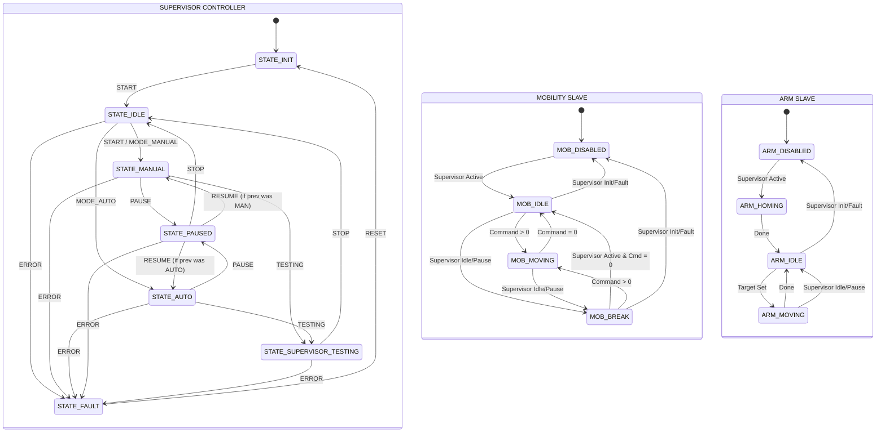

# System State Machine Documentation

This document describes the **Hierarchical Finite State Machine (HFSM)** architecture for the **sme-stm32f407-4wcl** control board. The system uses a **Supervisor-Subsystem** pattern to ensure centralized safety while allowing modular subsystem control.

## 1. Architectural Overview

The system is composed of one **Supervisor Controller** and multiple **Subsystem Slaves**.

- **Supervisor FSM**: Orchestrates global operational modes (Manual, Auto, Fault) and enforces top-level safety transitions.
- **Slave FSMs (Mobility/Arm)**: Manage specific hardware logic and kinematics. They run in dedicated RTOS tasks and react to the Supervisor FSM's state via a **Top-Down Override** mechanism.

---

## 2. Supervisor System FSM

| State | Description | Global Impact |
| :--- | :--- | :--- |
| **STATE_INIT** | Power-on / Hardware Init. | Forces all slaves to **DISABLED**. |
| **STATE_IDLE** | System ready. Safe standby. | Forces all slaves to **IDLE** / **BREAK**. |
| **STATE_MANUAL** | Operator driving mode. | Slaves follow local control commands. |
| **STATE_AUTO** | ROS-driven autonomous mode. | Slaves follow ROS commands. |
| **STATE_PAUSED**| Temporary halt (Manual/Auto). | Forces slaves to **STOP** (Holding positions). |
| **STATE_TESTING**| Diagnostic and test mode.     | Slaves allow raw hardware access. |
| **STATE_FAULT** | Critical error detected. | Immediate **DISABLED** of all power systems. |

---

## 3. Subsystem Slaves

### 3.1 Mobility FSM
Responsible for base movement and powertrain safety.

| State | Description | Reacts to Supervisor |
| :--- | :--- | :--- |
| **MOB_DISABLED** | Motors disabled / Signals cut. | Supervisor in **INIT** / **FAULT**. |
| **MOB_IDLE** | Ready for commands (Motors active but zero speed). | Waiting for targets in **MANUAL** / **AUTO**. |
| **MOB_BREAK** | Active stop / Forced hold. | Supervisor in **IDLE** / **PAUSED**. |
| **MOB_MOVING** | Moving according to target. | Supervisor in **MANUAL** / **AUTO**. |
| **MOB_FAULT** | Local hardware drive error. | Prevents movement. |

### 3.2 Robotic Arm FSM
Responsible for the 3-joint arm positioning.

| State | Description | Reacts to Supervisor |
| :--- | :--- | :--- |
| **ARM_DISABLED** | Servo power cut. | Supervisor in **INIT** / **FAULT**. |
| **ARM_HOMING** | Seeking zero-reference. | Triggered after Supervisor becomes Active. |
| **ARM_IDLE** | Position holding. | Supervisor in **IDLE** / **PAUSED**. |
| **ARM_MOVING** | Executing trajectory. | Supervisor in **MANUAL** / **AUTO**. |

---

## 4. Cross-Layer Logic (Safety Mechanisms)

The system enforces safety via two mechanisms: **Top-Down Override** and **Bottom-Up Supervision (Node Guarding)**.

### 4.1 Top-Down Override
Subsystems do not transition independently of the Supervisor Controller's safety context:
1.  **Fault Propagation**: If Supervisor enters `STATE_FAULT`, all slaves are immediately `DISABLED`.
2.  **Pause Dynamics**: If Supervisor enters `STATE_PAUSED`, Mobility goes to `BREAK` (active deceleration/hold) and Arm goes to `IDLE` (holding current position).
3.  **Homing Requirement**: The Arm subsystem cannot move (`MOVING`) until it successfully completes the `HOMING` routine, which is triggered when the Supervisor first enters an active mode (`MANUAL`/`AUTO`).

### 4.2 Bottom-Up Supervision (Node Guarding)
To ensure the Supervisor is always aware of slave status without allowing slaves to directly command the Supervisor FSM:
1.  **Central Error Registry**: A shared 64-bit mask (`error_flags`) in the `RobotState` structure holds bit-flags for all hardware errors. Slaves set their corresponding bits if a local hardware failure is detected.
2.  **Heartbeats (Watchdogs)**: Each slave increments a heartbeat counter at 50Hz.
3.  **Cyclic Polling**: The Supervisor Manager task polls the error registry and heartbeat counters every 20ms. If a hardware error is set, or a slave heartbeat stalls for >500ms, the Supervisor transitions to `STATE_FAULT` (which then triggers the Top-Down shutdown).

### 4.3 Control Sources & Business Rules

The system centralizes all state changes through the Supervisor. Each request is categorized into one of **4 Primary Roles**, each with specific priorities and operational restrictions.

| Role ID | Source Name | Description | Priority | Main Restriction |
| :---: | :--- | :--- | :---: | :--- |
| **0** | **Internal System** | Critical errors (Watchdogs, Motor Faults). | **Absolute** | Bypasses queue for immediate safety. |
| **1** | **Physical HW** | On-board buttons (K1 E-Stop, K2 Reset). | **Emergency** | Always active (Direct control). |
| **2** | **Gamepad (Joy)** | USB Gamepad (Manual driving). | **Manual** | **Prohibited** during AUTO mode. |
| **3** | **External Client** | Remote ROS/UART3 Commands. | **Auto** | **Prohibited** during MANUAL mode. |

#### Operational Restrictions (Enforced by Supervisor)

1.  **Isolation Switch (SW3)**: A physical switch on the board governs "Permissivity". If **SW3 is OFF**, the system enters **Absolute Isolation mode**, rejecting all commands from the **External Client (Role 3)** regardless of the system state.
2.  **Mode Protection**:
    -   To prevent remote interference during manual operations, **External Commands** are ignored while in `STATE_MANUAL`.
    -   To prevent accidental manual overrides during autonomous tasks, **Gamepad Commands** are ignored while in `STATE_AUTO`.
3.  **Authority Guard (Resume Logic)**:
    When the system is in `STATE_PAUSED`, it records the role ID that triggered the pause. A `RESUME` event will only be accepted if it comes from a role with **equal or higher priority**.

---

---

---

## 5. Transition Matrix (Supervisor)

| Current State | Event | Next State | Notes |
| :--- | :--- | :--- | :--- |
| **STATE_INIT** | `EVENT_START` | **STATE_IDLE** | Slaves remain disabled. |
| **STATE_IDLE** | `EVENT_START` | **STATE_MANUAL** | Slaves begin wakeup (Homing Arm). |
| **STATE_IDLE** | `EVENT_MODE_AUTO` | **STATE_AUTO** | Control authority to ROS. |
| **STATE_MANUAL** | `EVENT_PAUSE` | **STATE_PAUSED** | `BREAK` (Mob) / `IDLE` (Arm). |
| **STATE_MANUAL** | `EVENT_TESTING` | **STATE_TESTING** | Transition to diagnostic mode. |
| **STATE_AUTO**   | `EVENT_TESTING` | **STATE_TESTING** | Transition to diagnostic mode. |
| **STATE_PAUSED** | `EVENT_RESUME` | *Prev Mode* | Resumes previous motion context. |
| **STATE_TESTING**| `EVENT_STOP` | **STATE_IDLE** | Return to standby. |
| **ANY** | `EVENT_ERROR` | **STATE_FAULT** | **CRITICAL**: Full system shutdown. |

---

## 6. Transition Matrix (Slaves)

### 6.1 Mobility Subsystem
| Current State | Condition / Event | Next State | Notes |
| :--- | :--- | :--- | :--- |
| **ANY** | Supervisor in `INIT` / `FAULT` | **MOB_DISABLED** | Safety: Motors powered off. |
| **MOB_MOVING** | Supervisor in `IDLE` / `PAUSED` | **MOB_BREAK** | Active stop / holding (Top-down). |
| **MOB_DISABLED** | Supervisor in `MANUAL` / `AUTO` | **MOB_IDLE** | Wakeup sequence (Enabling drives). |
| **MOB_IDLE** | Velocity Targets != 0 | **MOB_MOVING** | Start trajectory execution. |
| **MOB_MOVING** | Velocity Targets == 0 | **MOB_IDLE** | Target reached / Stopped. |
| **MOB_BREAK** | Velocity Targets != 0 | **MOB_MOVING** | Breaking interrupted. |
| **ANY** | Driver/Link Error | **MOB_FAULT** | Local hardware fault detected. |

### 6.2 Robotic Arm Subsystem
| Current State | Condition / Event | Next State | Notes |
| :--- | :--- | :--- | :--- |
| **ANY** | Supervisor in `INIT` / `FAULT` | **ARM_DISABLED** | Safety: Servos unpowered. |
| **ARM_MOVING** | Supervisor in `IDLE` / `PAUSED` | **ARM_IDLE** | Holding current position (Top-down). |
| **ARM_DISABLED** | Supervisor in `MANUAL` / `AUTO` | **ARM_HOMING** | Auto-calibration on activation. |
| **ARM_HOMING** | Homing Finished | **ARM_IDLE** | Ready for trajectory commands. |
| **ARM_IDLE** | Joint Targets Set | **ARM_MOVING** | Start IK trajectory. |
| **ARM_MOVING** | Joint Targets Reached | **ARM_IDLE** | Position reached. |
| **ANY** | Servo Stall / Error | **ARM_FAULT** | Critical joint/servo failure. |

---

## 7. System Interaction Diagram

---

## 8. Implementation Details

- **Supervisor FSM**: [supervisor_fsm.c](../Application/MainLogic/Supervisor/Src/supervisor_fsm.c)
- **State Handlers**: [state_handlers.h](../Application/MainLogic/Supervisor/Inc/States/state_handlers.h)
- **Robot State (Global)**: [robot_state.h](../Application/Core/Inc/robot_state.h)
- **Mobility Subsystem**: [mobility_fsm.c](../Application/MainLogic/Slaves/MobilityStateMachine/Src/mobility_fsm.c)
- **Arm Subsystem**: [arm_fsm.c](../Application/MainLogic/Slaves/ArmStateMachine/Src/arm_fsm.c)
- **RTOS Tasks**: Managed in `Application/RTOSLogic/Src/`.

> [!IMPORTANT]
> **Safety Priority**: The `K2` physical button and local error detections always trigger `EVENT_ERROR` in the Supervisor FSM, which cascadingly disables all hardware slaves within one RTOS tick (20ms).
