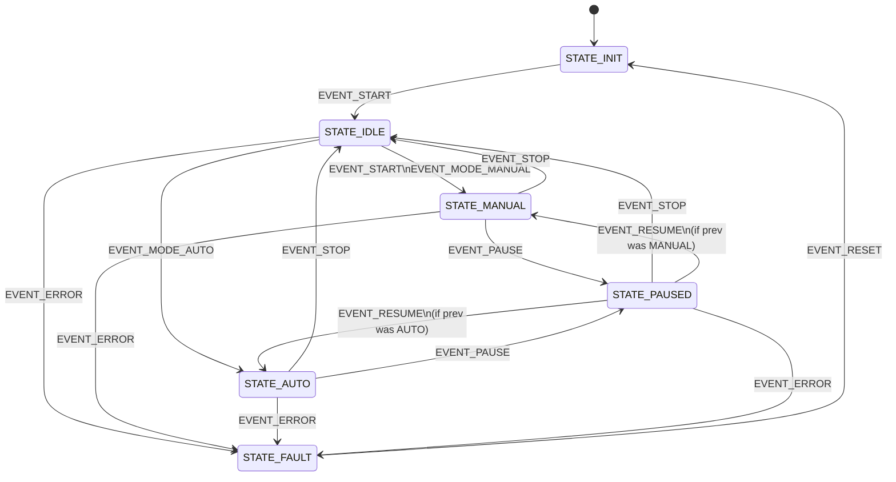

# System State Machine Documentation

This document describes the Finite State Machine (FSM) architecture for the **sme-stm32f407-4wcl** control board. The system implements a dual-mode control strategy (Manual/Autonomous) with strict safety transitions and a hierarchical pause/resume system.

## 1. System States

| State | Description | Visual Feedback (LED) |
| :--- | :--- | :--- |
| **STATE_INIT** | Initial power-on state. Hardware peripherals and OSAL initialization. | Off |
| **STATE_IDLE** | System is ready and waiting for control requests. Safe state for mode switching. | Off |
| **STATE_MANUAL** | **Manual Mode**: Direct operator control via physical buttons or manual UART commands. | Solid ON |
| **STATE_AUTO** | **Autonomous Mode**: Control is delegated to ROS (Robot Operating System) via UART commands. | Blinking / ON |
| **STATE_PAUSED**| **Temporary Halt**: System is paused but maintains the previous mode context. | Slow Pulse |
| **STATE_FAULT** | **Critical Error**: System halted due to hardware or software failure. Awaiting Reset. | Fast Blink |

## 2. System Events

| Event | Source | Resulting Action |
| :--- | :--- | :--- |
| **EVENT_START** | K1 Button / UART `START` | Requests transition to **Manual** mode (or IDLE if in INIT). |
| **EVENT_STOP** | K2 Button / UART `STOP` | **Global Safety Stop**: Forces return to IDLE from any state. |
| **EVENT_MODE_AUTO** | UART `AUTO` | Requests transition to **Autonomous** mode. |
| **EVENT_MODE_MANUAL**| UART `MANUAL` | Requests transition to **Manual** mode. |
| **EVENT_PAUSE** | UART/Safety Sensor | Suspends current operation and enters **PAUSED** state. |
| **EVENT_RESUME** | UART / Button | Attempts to return to the previous mode (Subject to Authority Check). |
| **EVENT_ERROR** | Hardware / SW3 Pin | Triggers immediate transition to **FAULT**. |
| **EVENT_RESET** | SW3 Button / UART `RESET` | Clears Faults and returns to INIT. |

## 3. Event Authority Levels

The system implements a hierarchical authority system for the **PAUSE/RESUME** logic. A `RESUME` event is only accepted if its source priority is equal to or higher than the source that triggered the `PAUSE`.

| Level | Source | Description |
| :--- | :--- | :--- |
| **3** | `SRC_PHYSICAL` | Physical On-Board Buttons (Highest priority). |
| **2** | `SRC_UART1_LOCAL` | Local Operator Console. |
| **1** | `SRC_UART3_ROS` | Remote Autonomous Control (Lowest priority). |

## 4. Transition Matrix

The system enforces a **Mandatory IDLE passage** rule: you cannot switch directly between Manual and Autonomous modes without stopping first.

| Current State | Event | Next State | Logic / Notes |
| :--- | :--- | :--- | :--- |
| **STATE_INIT** | `EVENT_START` | **STATE_IDLE** | System goes to standby after init. |
| **STATE_IDLE** | `EVENT_START` | **STATE_MANUAL** | Default start behavior. |
| **STATE_IDLE** | `EVENT_MODE_AUTO` | **STATE_AUTO** | Swaps control authority to ROS. |
| **STATE_IDLE** | `EVENT_ERROR` | **STATE_FAULT** | Hardware failure detected. |
| **STATE_MANUAL** | `EVENT_STOP` | **STATE_IDLE** | Stop requested by operator. |
| **STATE_MANUAL** | `EVENT_PAUSE` | **STATE_PAUSED** | Saves "Manual" as previous mode. |
| **STATE_MANUAL** | `EVENT_ERROR` | **STATE_FAULT** | Error while driving manually. |
| **STATE_AUTO** | `EVENT_STOP` | **STATE_IDLE** | Stop requested by ROS or Safety Button (K2). |
| **STATE_AUTO** | `EVENT_PAUSE` | **STATE_PAUSED** | Saves "Auto" as previous mode. |
| **STATE_AUTO** | `EVENT_ERROR` | **STATE_FAULT** | Error while in autonomous mode. |
| **STATE_PAUSED** | `EVENT_STOP` | **STATE_IDLE** | **Global Override**: Always allowed. |
| **STATE_PAUSED** | `EVENT_RESUME` | *Prev Mode* | Only if `source >= pauseAuthority`. |
| **STATE_PAUSED** | `EVENT_ERROR` | **STATE_FAULT** | Error while paused. |
| **STATE_FAULT** | `EVENT_RESET` | **STATE_INIT** | Reset logic triggers full re-init. |

## 5. Transition Diagram

---

## 6. Implementation Details

- **Headers**: [app_state_machine.h](../Application/MainLogic/Inc/app_state_machine.h)
- **Core Logic**: [app_state_machine.c](../Application/MainLogic/Src/app_state_machine.c)
- **Handlers**: Located in `Application/MainLogic/Src/States/` (e.g., [state_manual.c](../Application/MainLogic/Src/States/state_manual.c)).

> [!IMPORTANT]
> **Safety Override**: The physical button **K2** is hard-coded in `task_controller.c` to trigger `EVENT_STOP`, ensuring that a human operator can always stop the vehicle regardless of the ROS connection status.

