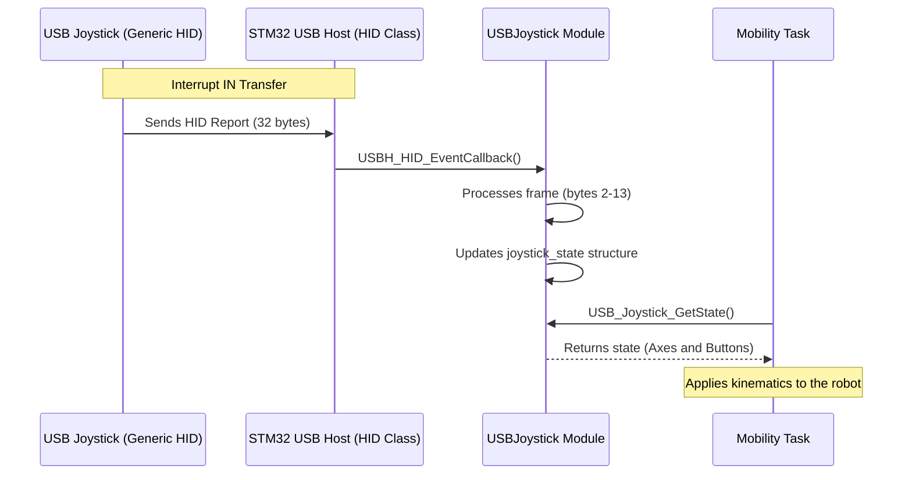

# USB Gamepad Joystick - Operating Protocol

This document describes the communication protocol and byte mapping for the USB Joystick connected to the STM32F407.

## 1. Data Frame Structure (HID Report)

The joystick sends **32-byte** HID reports. Based on log analysis, the structure is as follows:

| Byte Index | Field | Description and Values |
| :--- | :--- | :--- |
| **0** | Header 1 | Fixed value `00` |
| **1** | Header 2 | Fixed value `14` |
| **2** | **D-Pad & System** | Bitmask: • `01`: Arrow Up • `02`: Arrow Down • `04`: Arrow Left • `08`: Arrow Right • `10`: START • `20`: SELECT |
| **3** | **Action Buttons** | Bitmask: • `01`: L1 • `02`: R1 • `04`: MODE • `10`: Button A • `20`: Button B • `40`: Button X • `80`: Button Y |
| **4** | **L2 Trigger** | Hex value `00` to `FF` |
| **5** | **R2 Trigger** | Hex value `00` to `FF` |
| **6 - 7** | **Joy1 X (Horiz)** | 16-bit Little Endian: • Left: `00 80` (0x8000) • Right: `FF 7F` (0x7FFF) • Center: `00 00` |
| **8 - 9** | **Joy1 Y (Vert)** | 16-bit Little Endian: • Up: `FF 7F` (0x7FFF) • Down: `00 80` (0x8000) • Center: `00 00` |
| **10 - 11** | **Joy2 X (Horiz)** | 16-bit Little Endian: • Left: `00 80` (0x8000) • Right: `FF 7F` (0x7FFF) |
| **12 - 13** | **Joy2 Y (Vert)** | 16-bit Little Endian: • Up: `FF 7F` (0x7FFF) • Down: `00 80` (0x8000) |
| **14 - 31** | **Padding** | Unused bytes (filled with `00`) |

---

## 2. Sequence Diagram

The data flow from the peripheral to the movement control is described below:

---

## 3. Button Values Summary (Quick Table)

| Button | Byte | Value (Hex) |
| :--- | :--- | :--- |
| **ARROW UP** | 2 | `01` |
| **ARROW DOWN** | 2 | `02` |
| **ARROW LEFT** | 2 | `04` |
| **ARROW RIGHT** | 2 | `08` |
| **START** | 2 | `10` |
| **SELECT** | 2 | `20` |
| **L1** | 3 | `01` |
| **R1** | 3 | `02` |
| **MODE** | 3 | `04` |
| **A** | 3 | `10` |
| **B** | 3 | `20` |
| **X** | 3 | `40` |
| **Y** | 3 | `80` |
| **L2** | 4 | `FF` |
| **R2** | 5 | `FF` |

---

## 4. Analog Joystick Behavior

The joysticks use 16-bit signed values (two's complement), transmitted in **Little Endian** format.

*   **Range:** `0x8000` (-32768) to `0x7FFF` (32767).
*   **Neutral:** `0x0000`.
*   **Y-Axis Inversion:** Typically, "Up" returns positive values (`7FFF`) and "Down" returns negative values (`8000`), although this depends on the normalization applied in software.

## 5. System Logic (Button Functions)

The system maps these physical buttons to supervisor events:

| Button / Combo | Triggered Event | Description |
| :--- | :--- | :--- |
| **MODE** | `EVENT_ERROR` | **Emergency Stop**. Immediate fault state. |
| **SELECT** | `EVENT_STOP` | **Soft Stop**. Returns to IDLE if moving. |
| **START** | `EVENT_START` | **System Start**. Enters MANUAL mode from IDLE. |
| **L1+R1+L2+R2** | `EVENT_RESET` | **Reset sequence**. Hold for 2 seconds to clear FAULT. |

> [!NOTE]
> Joystick commands are only accepted in **MANUAL** or **IDLE** states. They are automatically ignored by the Supervisor if the system is in **AUTO** mode or if the Hardware Permissivity Switch (SW3) is OFF.
